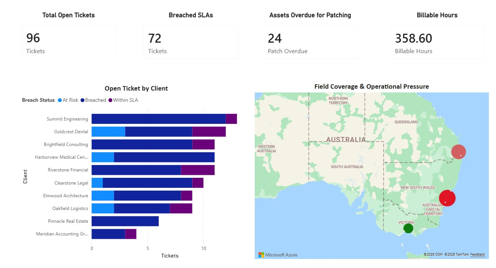
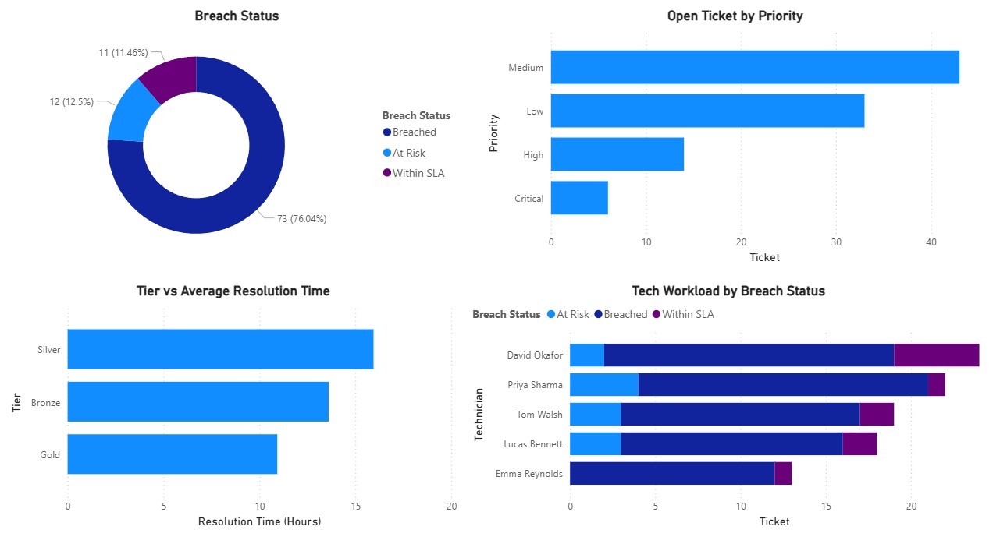
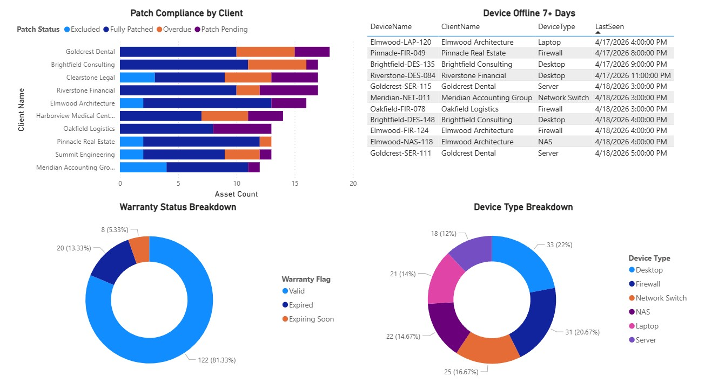
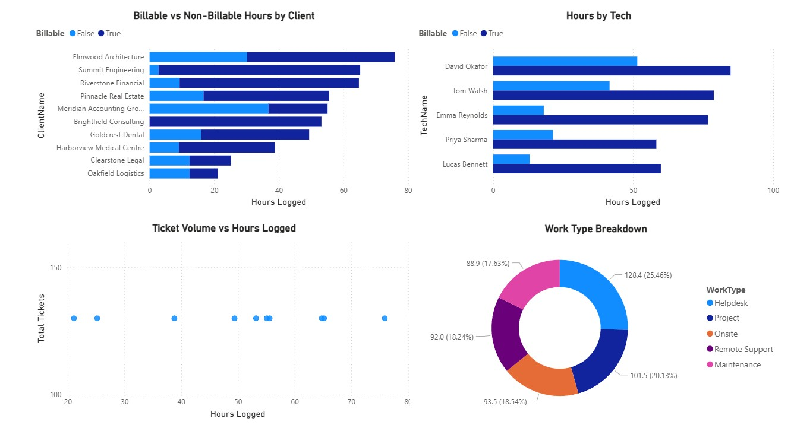
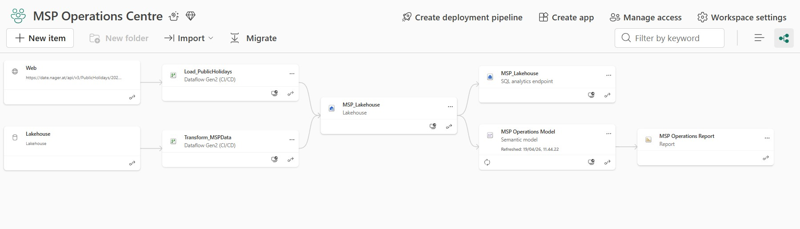

# MSP Operations Intelligence

A Microsoft Fabric portfolio project simulating a real-world managed service provider (MSP) analytics platform covering **ticket SLA health, asset patch compliance, timesheet utilisation, and geographic field coverage** across multiple Australian cities.

## Business Problem
For a managed service provider, three operational questions matter most, and having them answered in real time makes the difference between reactive and proactive support:

1. Are we meeting SLA commitments? Which clients have tickets approaching or past breach, and who owns them?
2. Are our clients' devices healthy? Which assets are unpatched, offline, or coming up on warranty expiry?
3. Are our hours being captured correctly? Is billable work being logged, and does it match the ticket volume per client?

This project builds a unified analytics platform that answers all three questions from a single data model, refreshable on demand.

## Architecture
```
CSV Files (tickets, assets, timesheets, clients, techs, cities, sla_config)
Public Holiday API (date.nager.at)
        ↓
MSP Lakehouse - Files (Bronze layer · OneLake)
        ↓
Dataflow Gen2 - Transform_MSPData  |  Load_PublicHolidays
        ↓
MSP Lakehouse - Tables (Silver layer · Delta format)
        ↓
MSP Operations Model (Semantic model · DAX measures · DirectLake)
        ↓
Power BI Report (4 pages)
```

## Dashboard Pages
### Page 1: Operations Overview

- Coverage Pressure Map: Australian cities plotted with color-coded operational load (Critical / High Load / Moderate / Healthy) based on a weighted pressure score factoring open ticket priorities and overdue assets per tech
- KPI cards: Total open tickets, breached SLAs, assets overdue for patching, billable hours this month
- Open tickets by client: stacked bar colored by breach status for at-a-glance client prioritisation

### Page 2: Ticket & SLA Health

- Breach status: proportion of open tickets in Breached/At Risk/Within SLA
- Open tickets by priority
- Tech workload colored by breach status, identifies overloaded technicians
- Tier vs average resolution time, validates whether Gold clients receive faster service than Bronze
  
### Page 3: Asset & Patch Compliance

- Patch compliance by client: stacked bar across Fully Patched/Patch Pending/Overdue/Excluded
- Devices offline 7+ days: table sorted by last seen date, flags potential security risks
- Warranty status breakdown: donut chart showing Expired/Expiring Soon/Valid/Unknown
- Device type breakdown: distribution across Laptops, Desktops, Servers, Network equipment
  
### Page 4: Timesheet & Billable Hours

- Billable vs non-billable hours per client: stacked bar identifying where unbilled work accumulates
- Hours by technician: who is carrying the heaviest load
- Ticket volume vs hours logged: scatter plot revealing clients with high ticket counts but low logged hours
- Work type breakdown: Helpdesk/Project/Maintenance/Onsite/Remote Support

## Key Technical Highlights
### Coverage Pressure Score
A custom DAX weighted metric that quantifies operational load per city, normalised by technician headcount:

```
WeightedTickets = (Critical × 4) + (High × 3) + (Medium × 2) + (Low × 1)
CoveragePressureScore = (WeightedTickets + OverdueAssets) ÷ TechCount
```

Cities with no clients or tech returns blank, keeping expansion cities visually neutral on the map
See: [`dax/coverage_pressure_score.dax`](dax/coverage_pressure_score.dax)

### Public Holiday API Integration
Australian public holidays are pulled live from the [Nager.Date REST API](https://date.nager.at/api/v3/PublicHolidays/2026/AU) via a dedicated Dataflow Gen2 (`Load_PublicHolidays`), independent of the main transformation pipeline. This enables SLA-adjusted reporting — tickets raised on public holidays can be excluded from breach calculations, reflecting real MSP contract terms.

### Isolated Reference Table Pattern
`Cities_Silver` intentionally has no active relationships to other tables in the Semantic Model. This avoids ambiguous filter path errors that arise when a hub table connects to multiple tables that already have direct relationships between them. City-level filtering is handled entirely within DAX measures using `FILTER()` and `SELECTEDVALUE()`, bypassing the relationship engine.

### Separate Pipeline Architecture
Two independent Dataflow Gen2 instances handle different refresh cadences:
- Transform_MSPData: processes all operational CSV sources, runs on demand
- Load_PublicHolidays: pulls from external API, can run weekly since holidays don't change daily

## Data Sources
All client, company, technician, and ticket data is **fictional and generated for portfolio purposes**. No real business data is used.

| File | Rows | Description |
|---|---|---|
| tickets.csv | 130 | Support tickets with priority, status, SLA category |
| assets.csv | 150 | Devices with patch status, OS version, warranty expiry |
| timesheets.csv | 120 | Tech hours logged per client with billable flag |
| clients.csv | 10 | Client master with tier, city, account manager, coordinates |
| techs.csv | 5 | Technician master with base city, seniority, specialisation |
| cities.csv | 20 | Australian city reference table with coordinates |
| sla_config.csv | 4 | SLA hours by priority (Critical=1h, High=4h, Medium=8h, Low=24h) |

Public holiday data sourced live from [date.nager.at](https://date.nager.at), free, no authentication required.

## Tech Stack
`Microsoft Fabric` `Power BI` `DAX` `Power Query M` `Dataflow Gen2` `Lakehouse` `REST API` `DirectLake`

## DAX Measures
| Measure | Description |
|---|---|
| [Coverage Pressure Score](dax/coverage_pressure_score.dax) | Weighted operational load per city normalised by tech count |
| [Pressure Label](dax/pressure_label.dax) | Human-readable category for map color coding |
| [Tech Count by City](dax/tech_count_by_city.dax) | Technicians based in selected city |
| [Client Count by City](dax/client_count_by_city.dax) | Clients located in selected city |
| [Total Tickets](dax/total_tickets.dax) | Cross-table ticket count for scatter plot visuals |

## Fabric Workspace Structure


## Author

**Eva Ananda**

Microsoft 365 Administrator · Power Platform Developer

CompTIA Security+ · AWS Cloud Practitioner

[LinkedIn](https://www.linkedin.com/in/evarosalinaananda/) · [Upwork](https://www.upwork.com/freelancers/~0183dfe0c2fecbff91)
